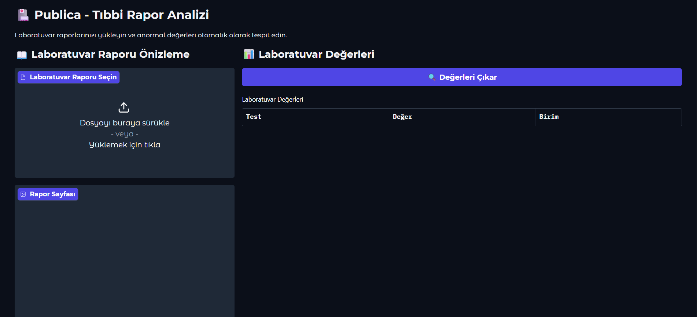
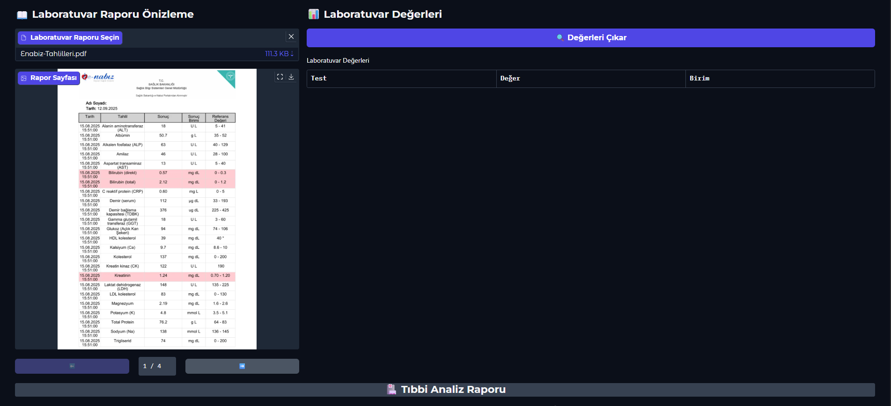
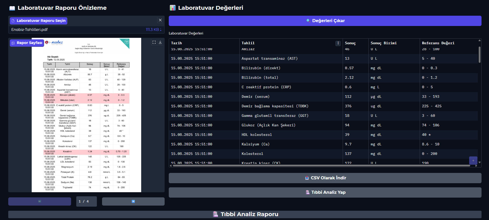
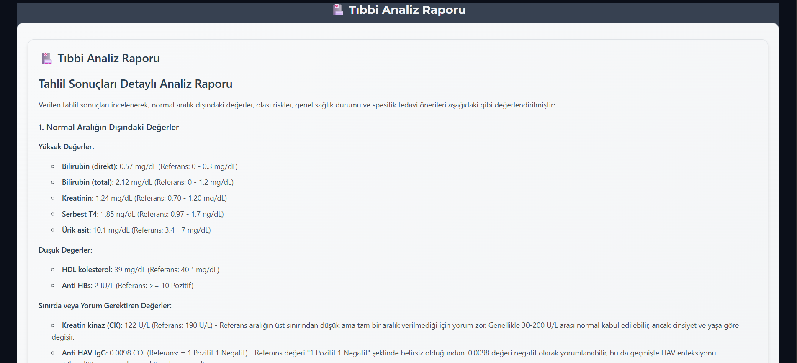
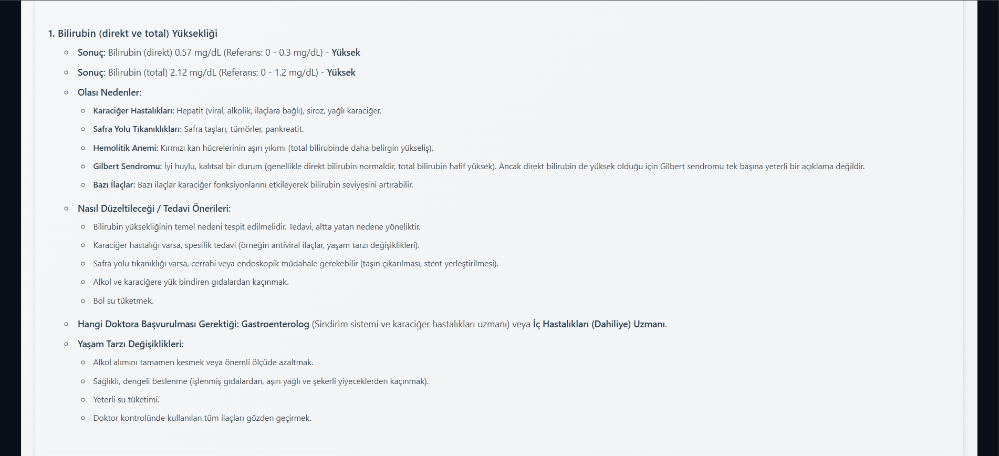

#  Publica - Tıbbi Rapor Analizi

Laboratuvar raporlarını otomatik olarak analiz eden ve anormal değerleri tespit eden yapay zeka destekli bir tıbbi analiz platformu. PDF formatındaki laboratuvar raporlarını işleyerek, sağlık durumu hakkında detaylı analiz raporları sunar.

##  Ne Yapıyor?

Bu proje ile:
-  Laboratuvar raporlarını hızlıca analiz edebilirsiniz
-  Anormal değerleri otomatik olarak tespit eder
-  Sonuçları düzenli tablolar halinde sunar
-  Tıbbi öneriler ve açıklamalar sağlar
-  Web arayüzü ile kolay kullanım

##  Nasıl Çalışıyor?

###  PDF İşleme
- **PDF'den Tablo Çıkarma**: Docling kütüphanesi ile PDF'deki tabloları otomatik olarak çıkarır
- **Veri Temizleme**: Gereksiz bilgileri filtreler ve sadece laboratuvar değerlerini alır
- **Tablo Birleştirme**: Birden fazla tabloyu tek tabloda birleştirir
- **Sayfa Görüntüleme**: PDF sayfalarını görüntü olarak gösterir

###  AI Analiz
- **Anormal Değer Tespiti**: Normal aralıkların dışındaki değerleri otomatik bulur
- **Referans Bilgileri**: 100+ laboratuvar testi için detaylı açıklamalar
- **Tıbbi Öneriler**: Her anormal değer için spesifik açıklamalar
- **Tedavi Rehberi**: Hangi doktora başvurulması gerektiği konusunda bilgi

###  Web Arayüzü
- **PDF Önizleme**: Sayfa sayfa PDF görüntüleme
- **Navigasyon**: Önceki/sonraki sayfa butonları
- **Veri Çıkarma**: Tek tıkla tablo çıkarma
- **Analiz**: AI ile kapsamlı tıbbi analiz
- **İndirme**: CSV formatında sonuç indirme

##  Kullanılan Teknolojiler

- **Python**: Ana programlama dili
- **Docling**: PDF'den tablo çıkarma
- **PyMuPDF**: PDF sayfa görüntüleme
- **Pandas**: Veri işleme ve analiz
- **Gradio**: Web arayüzü
- **Google Gemini**: AI analiz
- **Pinecone**: Vector database
- **Cohere**: Reranking

##  Örnek Çıktı

Laboratuvar değerleri şu şekilde analiz edilir:
```text
1. Bilirubin (direkt ve total) Yüksekliği
Sonuç: Bilirubin (direkt) 0.57 mg/dL (Referans: 0 - 0.3 mg/dL) - Yüksek
Sonuç: Bilirubin (total) 2.12 mg/dL (Referans: 0 - 1.2 mg/dL) - Yüksek
Olası Nedenler:
Karaciğer Hastalıkları: Hepatit (viral, alkolik, ilaçlara bağlı), siroz, yağlı karaciğer.
Safra Yolu Tıkanıklıkları: Safra taşları, tümörler, pankreatit.
Hemolitik Anemi: Kırmızı kan hücrelerinin aşırı yıkımı (total bilirubinde daha belirgin yükseliş).
Gilbert Sendromu: İyi huylu, kalıtsal bir durum (genellikle direkt bilirubin normaldir, total bilirubin hafif yüksek). Ancak direkt bilirubin de yüksek olduğu için Gilbert sendromu tek başına yeterli bir açıklama değildir.
Bazı İlaçlar: Bazı ilaçlar karaciğer fonksiyonlarını etkileyerek bilirubin seviyesini artırabilir.
```

##  Proje Görselleri

### Ana Arayüz


### PDF Yükleme ve Önizleme


### Veri Çıkarma İşlemi


### Analiz Sonuçları


### Detaylı Tıbbi Analiz


##  Kimler Kullanabilir?

- **Hastalar**: Laboratuvar sonuçlarını anlamak için
- **Tıp Öğrencileri**: Vaka analizi ve öğrenme için
- **Araştırmacılar**: Toplu veri analizi için
- **Sağlık Çalışanları**: Hızlı değerlendirme için

---

**Önemli Not**: Bu proje eğitim amaçlıdır. Tıbbi kararlar için mutlaka doktor görüşü alınmalıdır.
